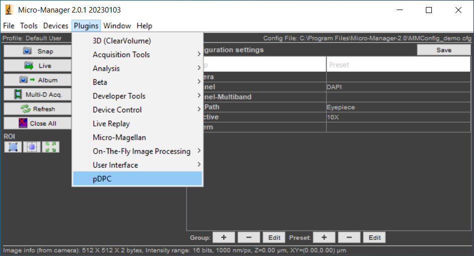

Table of Contents  
---
- [MM2\_pDPC](#mm2_pdpc)
  - [Overview](#overview)
    - [Introduction](#introduction)
    - [Important notes](#important-notes)
    - [Useful external links](#useful-external-links)
  - [Installation](#installation)
  - [Pre-requisite for python-based features](#pre-requisite-for-python-based-features)
  - [User guide](#user-guide)
    - [_**Live**_](#live)
    - [_**Recon**_](#recon)
    - [_**Cali**_](#cali)
    - [_**LiveSplit**_](#livesplit)
    - [Special notes](#special-notes)
      - [Launch/Stop python background process](#launchstop-python-background-process)
      - [Parameters \& Presets](#parameters--presets)
        - [Physical meaning of pDPC parameters](#physical-meaning-of-pdpc-parameters)

# MM2_pDPC  

## Overview

### Introduction

This is a plugin for *&mu;Manager* (MM) (version 2.0 or later) to perform image processing etc. for polarisation-resolved differential phase contrast (_pDPC_) microscopy. For details on the _pDPC_ technique, see [this paper](https://onlinelibrary.wiley.com/doi/full/10.1002/jbio.202100144). 


This plugin provides four main features:
- _**Live**_: 
	
	Reconstruct phase from the raw camera image acquired by MM LiveSnap and then live display the reconstructed phase image.  

- _**Recon**_: 
  
	Reconstruct phase from raw image(s) (single TIFF file) loaded from a given path and then save the reconstructed phase image(s) to a specified path also as single TIFF file.  

- _**Cali**_:
	  
	Calibrate the response matrices for the _pDPC_ system using a set of calibration images loaded from given paths.

- _**LiveSplit**_: 

	Interleave the raw camera image acquired by MM LiveSnap into four sub channel images and then live display the four sub channel images.

### Important notes 
- Among above features, _**Live**_, _**Recon**_, and _**Cali**_ rely on image processing in python and cannot be used simultaneously, while _**LiveSplit**_ does not. 
- The python-based features do not require the user to run python scripts directly, but instead the user need:
    1. Before launching the plugin, setup a proper Anaconda environment with all required python packages installed (see [here](#pre-requisite-for-python-based-features) for details).
    1. Before/after using the feature(s) in the plugin, launch/stop python background process (see [here](#launchstop-python-background-process) for details). 
- _**Live**_ and _**Recon**_ features use `current_settings` in `Preset Panel` to reconstruct phase (see [here](#parameters--presets) for details on parameters & presets). 
- _**Live**_ and _**LiveSplit**_ features use whatever camera currently set as `Core-Camera` in MM. 
	- Demo videos below use `MMConfig_Demo.cfg`, which is a demo configuration provided by MM, for illustration purposes only. 
    
        `Core-Camera` in this demo configuration is set as `DCam` (a virtual camera).

	- In practice, `Core-Camera` should be set as the polarisation camera used for _pDPC_ imaging.

### Useful external links
- [*&mu;Manager* 2.0](https://micro-manager.org/Version_2.0) 
- [Anaconda tutorial](https://docs.anaconda.com/free/navigator/tutorials/) & [conda commands](https://docs.conda.io/projects/conda/en/stable/commands/index.html) 

## Installation 

1. Install [*&mu;Manager*](https://micro-manager.org/Download_Micro-Manager_Latest_Release) (version 2.0.0 or later) if not yet.
1. Download [MM2_pDPC.jar](../dist/MM2_pDPC.jar) from this repo and place it in the `mmplugins` folder under the *&mu;Manager* installation root.  

To check if the plugin is successfully installed, launch *&mu;Manager* and check if the plugin name, `pDPC`, appears in the `Plugins` menu as shown in the figure below. 

<p align=center>

</p>

## Pre-requisite for python-based features 

To use the python-based features of this plugin, one **_MUST_** make sure that there is at least one Anaconda environment with the required python packages installed.

1. Install [Anaconda](https://docs.anaconda.com/free/anaconda/install/index.html) if not yet.
1. Record the path to Anaconda installation directory. 
  
	This path will be used in the plugin to identify available environments and locate their corr. python executables.

1. Setup an Anaconda environment with the required python packages if not yet. 
  
	This plugin requires the following python packages:  
	- opencv-python 
	- numpy
	- tifffile
	- PyQt5
	- magicgui
	- scipy 
  
	Below is an example of how to create a new Anaconda environment and install all required python packages.

	```bash
	conda create -n pdpc-env python=3.10 
	conda activate pdpc-env 
	conda install -c conda-forge opencv numpy tifffile pyqt magicgui scipy 
	```       

## User guide

### _**Live**_  

<video width="100%" controls>
<source type="video/mp4" src="Live.mp4">
</video> 

_If video is not shown in browser, click [here](Live.mp4) to download and view it._

Empirically, set binning to 2 is a good trade-off between speed and resolution for phase reconstruction on live.

### _**Recon**_

<video width="100%" controls>
<source type="video/mp4" src="Recon.mp4">
</video>

_If video is not shown in browser, click [here](Recon.mp4) to download and view it._

### _**Cali**_

<video width="100%" controls>
<source type="video/mp4" src="Cali.mp4">
</video>

_If video is not shown in browser, click [here](Cali.mp4) to download and view it._

### _**LiveSplit**_ 

<video width="100%" controls>
<source type="video/mp4" src="LiveSplit.mp4">
</video>

_If video is not shown in browser, click [here](LiveSplit.mp4) to download and view it._

### Special notes  

#### Launch/Stop python background process 

- Launch python process  

	<video width="100%" controls>
	<source type="video/mp4" src="launch_python_process.mp4"> 
	</video> 
	
	_If video is not shown in browser, click [here](launch_python_process.mp4) to download and view it._

- Stop python process

	<video width="100%" controls>
	<source type="video/mp4" src="stop_python_process.mp4"> 
	</video> 

	_If video is not shown in browser, click [here](stop_python_process.mp4) to download and view it._

#### Parameters & Presets

<video width="100%" controls>
<source type="video/mp4" src="params_presets.mp4"> 
</video> 

_If video is not shown in browser, click [here](params_presets.mp4) to download and view it._

`preset name` is the identifier used to update/add/remove preset.

If `Use advanced pDPC params` is not selected, only basic parameters in `Current settings` will be passed to python for phase reconstruction with default ideal values used for advanced parameters.   

##### Physical meaning of pDPC parameters  

- Basic parameters:
    - NA_illu: maximum illumination NA;
    - lbd_um: illumination wavelength in um;
    - NA_img: objective NA;
    - mag: magnification of the microscope configuration;
    - seq: 0-7 integer, to specify the order of the QP w.r.t. the camera sub polarization channels; usually sweeped to find the correct value;
    - binning: binning factor during reconstruction;
    - use_pupil: always false for condenser-based pDPC;
    - reg_p: regularization parameter for phase reconstruction; empirically set; usually 0.001 - 0.01;
    - reg_u: regularization parameter for amplitude reconstruction; empirically set; usually 1e-5;
    - px_cam_um: camera sensor physical pixel size in um; always 3.45 for [FLIR Blackfly PolCam](https://www.flir.co.uk/products/blackfly-s-usb3/?model=BFS-U3-51S5P-C&vertical=machine+vision&segment=iis) we've been used;
  
- Advanced parameters:
    - Q2S: QPs to sub polarization channels mapping matrix, in string format; 4x4 matrix; ideally should be "[[1.0, 0.5, 0.5, 0.0], [0.5, 1.0, 0.0, 0.5], [ 0.5, 0.0, 1.0, 0.5], [ 0.0, 0.5, 0.5, 1.0]]";
    - quadGap_mm: Gap width between neighbor QP apertures in mm, at condenser back focal plane; default 0; depending on actual QP mask;
    - quadRotate_rad: Rotation angle of the QP mask w.r.t. the camera sub polarization channels; default 0; 
    - S_OffAxisYX_mm: Off-axis distance of the QP mask w.r.t. optical axis in mm; default 0;  
    - P_OffAxisYX_mm: Off-axis distance of the objective w.r.t. optical axis in mm; default 0; 
    - condenser_f_mm: condenser focal length in mm; default 30; 
    - objective_f_mm: objective focal length in mm; default 18;  
    - quadNorm_coeff: system transmission for each QP, in string format; 1x4 matrix; default "[1.0, 1.0, 1.0, 1.0]";
    - sp_pattern: 0-2 integer, to specify how sub polarisation channel images are used during phase reconstruction; should always be 1 (default) for now;
    - dark_bkg_path: path to the dark background image file; default "None";
    - light_bkg_path: path to the light background image file; default "None";
